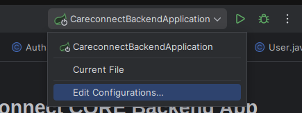
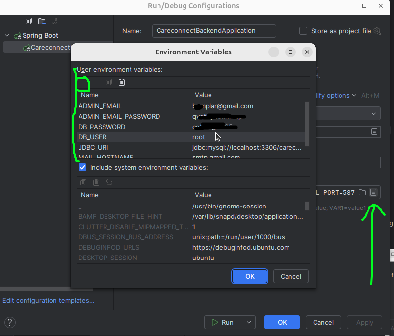

# **CareConnect CORE Backend App**
This is the first backend app after the prototype of CareConnect that is ready for testing. 
This README will help you set it up on your local computer.

## **Table Of Contents**
<!-- TOC -->
* [**CareConnect CORE Backend App**](#careconnect-core-backend-app)
  * [**Table Of Contents**](#table-of-contents)
  * [Context of most of those instructions](#context-of-most-of-those-instructions)
  * [Prerequisite](#prerequisite)
  * [Quick Setup (Recommended)](#quick-setup-recommended)
    * [1. Environment Configuration](#1-environment-configuration)
    * [2. Start the Application](#2-start-the-application)
      * [Linux/macOS](#linuxmacos)
      * [Windows](#windows)
  * [Alternative Setup (IDE Configuration)](#alternative-setup-ide-configuration)
  * [Features Included](#features-included)
    * [🔔 Firebase Push Notifications](#-firebase-push-notifications)
    * [🔐 Authentication & Security](#-authentication--security)
    * [🏥 Healthcare Features](#-healthcare-features)
    * [📧 Multi-Provider Email Support](#-multi-provider-email-support)
    * [💳 Payment Integration](#-payment-integration)
    * [🤖 AI Integration](#-ai-integration)
    * [☁️ Cloud Storage](#-cloud-storage)
  * [API Documentation](#api-documentation)
  * [Optional Tools](#optional-tools)
  * [Support](#support)
  * [Deployment on AWS](#deployment-on-aws)
<!-- TOC -->

## Context of most of those instructions

- They are generate based on a Linux (Ubuntu) VM.
- Intellij IDEA was used (You can get a student license through UMGC)

Although, the following would be similar to most platforms an IDEs you want to use.

## Prerequisite
- Install Git you can follow this link.
- Install JDK 17 (required by Maven build configuration).
- Install Docker Desktop/Engine and Docker Compose (used for the local PostgreSQL database).
- Clone the code (your branch if you are planning on make changes to the code).

📌 Database setup: See the PostgreSQL Docker instructions here: [pg_docker/README.md](pg_docker/README.md)

## Quick Setup (Recommended)

### 1. Environment Configuration
Set up your environment variables using the new simplified approach:

```bash
# Copy the environment template
cp .env.example .env

# Edit with your actual credentials
nano .env  # or use your preferred editor
```

**Required variables** (minimum to start the application):
- `JDBC_URI` - Your PostgreSQL connection string
- `DB_USER` - Your database username  
- `DB_PASSWORD` - Your database password
- `SECURITY_JWT_SECRET` - JWT secret key (256+ bits)

Need Gmail OAuth for mail digests? Follow the programmer guide in `docs/google-oauth-setup.md`.

**Firebase variables** (required for notifications):
- `FIREBASE_PROJECT_ID=careconnectcapstone`
- `FIREBASE_SENDER_ID=663999888931`
- Download `firebase-service-account.json` to `src/main/resources/`

📖 **For detailed setup instructions, see [README-ENV.md](README-ENV.md)**

### 2. Start the Application

#### Linux/macOS
```bash
chmod +x run-dev.sh
./run-dev.sh
```

Alternative (manual):
```bash
chmod +x load-env.sh
./load-env.sh mvn spring-boot:run -Dspring.profiles.active=dev
```

#### Windows
- Option 1 (recommended): Use Git Bash and run the same commands as Linux/macOS:
```bash
chmod +x run-dev.sh
./run-dev.sh
```
- Option 2 (manual): Ensure Docker Desktop is running, database is up (see pg_docker), then run:
```cmd
mvn spring-boot:run -Dspring.profiles.active=dev
```

## Development profile flags (application-dev.properties)

The development profile disables external services to simplify local runs. Key flags in `src/main/resources/application-dev.properties`:
- `careconnect.database.use-aws-config=false` — Use local JDBC settings instead of AWS SSM/Secrets based config
- `careconnect.aws.enabled=false` — Disable AWS integrations in dev
- `careconnect.stripe.enabled=false` — Disable Stripe in dev
- `careconnect.openai.enabled=false` — Disable OpenAI in dev
- `careconnect.deepseek.enabled=false` — Disable DeepSeek in dev
- `app.file.storage.use-s3=false` — Use local storage instead of S3

For reference, the dev profile also sets PostgreSQL defaults and uses Flyway for migrations.

## Alternative Setup (IDE Configuration)

If you prefer to use your IDE's run configuration instead of the `.env` approach:

1. Open your IDE and open the ***`core`*** project/folder with your IDE

2. Add your env variables
    
    - By Default advanced IDE like Intellij just generate a Run Configuration for you 
    based of the file with the entrypoint/touchpoint.<br/>To keep things simple just edit it.
        1. Go to the name of the main class show on the top right see image below. Click on `Edit Configurations...`
        
    
        2. With the Run Configuration of the name of the class selected make sure `Environment Variables` is showing up.
        
            - If you do not see `Environment Variables`<br/>Click on the `Modify options` dropdown and check `Environment Variables`. See below
            

        3. Add your variables in the `Environment Variables` field. The minimum required variables:
        ```
        JDBC_URI=jdbc:postgresql://localhost:5432/careconnect;DB_USER=postgres;DB_PASSWORD=<YOUR_PASSWORD>;SECURITY_JWT_SECRET=<YOUR_JWT_SECRET>;FIREBASE_PROJECT_ID=careconnectcapstone;FIREBASE_SENDER_ID=663999888931
        ```
        
        The format is simple `KEY=value;NEW_KEY=value` <br/>You can also use a file if you prefer or add the variable with the GUI. 
        
        - Click on the last button of the `Environment Variables` field. You should see a screen like below, fill it out line by line.
                

3. Add AWS Secret and Region (Configure AWS CLI)

   There are multiples way you can do that.<br/>
   You need to have `AWS_ACCESS_KEY_ID`, `AWS_SECRET_ACCESS_KEY`, `AWS_REGION` setup in your environment variables. You can also do that in the IDE or make it global in your System Environment variable.
   Go to for more details [Configure your AWS CLI](https://docs.aws.amazon.com/cli/latest/userguide/cli-chap-configure.html) - to make it simple we suggest you to use environment variables [here is the sub link](https://docs.aws.amazon.com/cli/latest/userguide/cli-configure-envvars.html).

4. Retrieving properties from SSM Parameter Store

   This configuration is more for AWS deployment. 
    - When you are deploying on AWS make your property equal the full name of the Parameter you define in Parameter store.<br/>
        ```
        JDBC_URI=JDBC_URI
        DB_USER=DB_USER
        DB_PASSWORD=DB_PASSWORD
        SECURITY_JWT_SECRET=SEC_JWT_SECRET
        ...
        ```
    - On your local computer: You can leave full value of the property from your local because if the `ParameterStoreService` cannot retrieve the parameter it would return the initial value your provided.
        ```
        JDBC_URI=jdbc:mysql://localhost:3306/careconnect
        DB_USER=root
        DB_PASSWORD=root
        SECURITY_JWT_SECRET=your_jwt_secret
        ...
        ```
---
## Verifying Email in Dev Profile
1. After registering for an account, look at the back end logs. You should have something as follows:
```
🔧 DEV MODE - Email logged to console:
  Provider: console
  To: test@test.com
  From: dev@careconnect.local
  Subject: CareConnect Email Verification
  Content: Please verify your email by clicking: http://localhost:50030/v1/api/auth/verify/fd5682b6-bf59-4e0c-be8f-b437cb2f1a4a
  ===================================
```
2. Click or copy and paste the link in a browser
3. You should receive the following message: "Your email has been verified! You can now log in."
---

## API Documentation

Once the application is running, you can access:
- **Swagger UI**: http://localhost:8080/swagger-ui.html
- **API Docs**: http://localhost:8080/v3/api-docs

## Optional Tools

* [**Postman**](https://www.postman.com/downloads/) or [**Bruno**](https://www.usebruno.com/downloads) – For manual API endpoint testing.
* MySQL Workbench - To manipulate your database

---

## Support

For credentials, setup help, or onboarding, contact your team lead or project maintainer.

📖 **For detailed environment setup, see [README-ENV.md](README-ENV.md)**  
🔥 **For Firebase notifications, see [FIREBASE_NOTIFICATIONS.md](FIREBASE_NOTIFICATIONS.md)**

---


## Deployment on AWS
This can be done after creating the infrastructure resources using the Terraform scripts. Follow the README(s) for more on the Terraform scripts. 

1. Install and Configure your AWS Cli. Jump to step 2 if you have done that already.
2. Build the project and upload the zip file to AWS S3. 
   ```
   aws s3 cp target/careconnect-backend-0.0.1-SNAPSHOT-lambda-package.zip s3://<S3_BUCKET_NAME>/cc-backend-jars/careconnect-backend-0.0.1-SNAPSHOT-lambda-package.zip --sse aws:kms
    ```

3. If this the first deployment and initial resource creation. Once the file is uploaded use the Terraform compute application's scripts to create the Lambda.<br/>
The Terraform compute app will create the Lambda with the S3 file, create a new Lambda version, create the API Gateway integration with the Lambda version.

4. If this is a subsequent deployment, you can use these commands to update the function and create a new version. 
   <br/>You might still need to go to the console to complete the API Gateway integration update, or once the zip is in S3 you can skip those commands and do the rest on the Console.
    <br>Ideally an automated flow will be provided, and you won't need to do anything after the file is upload to S3.
```sh
# This is to update the function. Please replace your <S3_BUCKET_NAME>.
aws lambda update-function-code --function-name cc_main_backend \
    --s3-bucket <S3_BUCKET_NAME> --s3-key cc-backend-jars/careconnect-backend-0.0.1-SNAPSHOT-lambda-package.zip

# This is to publish a new version for the lambda after the code is updated.  Please update the description to be meaningful to your version.
aws lambda publish-version --function-name cc_main_backend --description "M3 Deployment"

# This is to update the API Gateway Integration. Please replace the <API Id>, <INTEGRATION_ID>, <AWS_ACCOUNT_ID> and <VERSION_NUMBER>.
aws apigatewayv2 update-integration \
    --api-id <API_DI> \
    --integration-id <INTEGRATION_ID> \
    --integration-uri arn:aws:lambda:us-east-1:<AWS_ACCOUNT_ID>:function:cc_main_backend:<VERSION_NUMBER>
```
